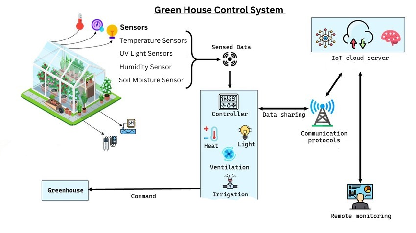
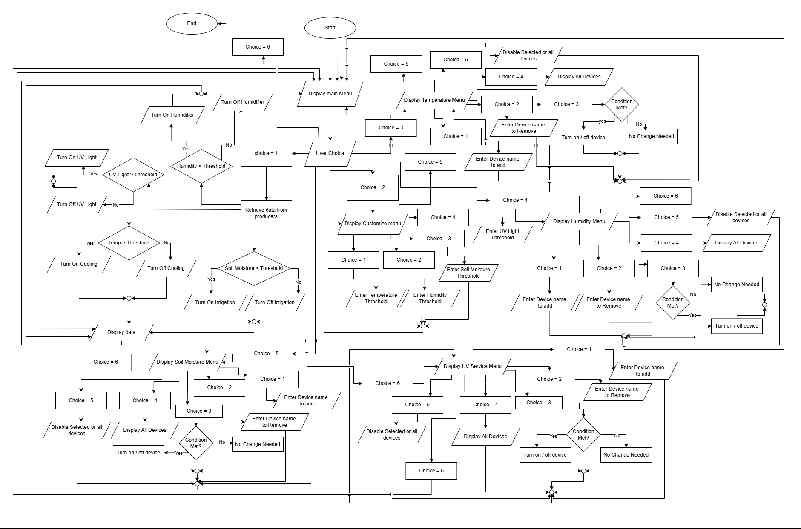

# 🌱 Greenhouse Monitoring and Control System 🌿
---

---

Welcome to the **Greenhouse Monitoring and Control System**! This system leverages the **OSGi framework** to manage and control a variety of devices that monitor and maintain the optimal environment inside a greenhouse. The system provides real-time management of temperature 🌡️, humidity 💧, soil moisture 🌾, and UV light 🌞 levels. With this system, you can ensure a healthy and thriving greenhouse environment for your plants! 🌿

---

## 📋 Features

### **Main Menu** 🍽️

The **GreenHouseController** is the central hub that guides users through the system. Upon entering, you will see the following options:

1. **Get Sensor Data** 📊: Retrieve and display real-time data from sensors.
2. **Customize Sensor Data** 🛠️: Edit threshold values for key environmental parameters.
3. **Control Temperature Devices** ❄️🔥: Manage temperature control devices (e.g., air conditioners, heaters).
4. **Control Humidity Devices** 💦: Manage devices like humidifiers.
5. **Control Soil Moisture Devices** 🌱: Activate irrigation devices to maintain soil moisture.
6. **Control UV Light Devices** ☀️: Manage UV light systems for plant lighting.
7. **Exit the System** 🚪: Exit the system and close the application.

---

## 🖼️ Diagrams 🧑‍💻

Here are some diagrams for a clearer understanding of the system architecture and flow:

- **System Architecture Diagram** 🏛️  
   

- **Device Management Flow Diagram** 🔄  
   


---
### **Device Management Menus** 🔧

Each type of device in the system can be managed with an intuitive submenu:

#### 1. **Add Device** ➕
   - Add new devices to the system.
   - Confirmation:  
     `✅ "deviceName" added successfully!`

#### 2. **Remove Device** ❌
   - Remove unnecessary devices from the system.
   - Confirmation:  
     `✅ "deviceName" removed successfully!`

#### 3. **Change Device Mode** 🔄
   - Toggle the device mode (ON/OFF).
   - Devices automatically adjust based on environmental conditions, such as turning on air conditioners if it's too hot.

#### 4. **View All Devices Info** 🧐
   - Displays all devices with their current status (ON/OFF) and relevant information.

#### 5. **Disable Devices** 🚫
   - Disable specific devices or all devices at once.

---

### **Threshold-Based Device Control** 🎛️

The system ensures that devices are activated or deactivated based on user-defined threshold values:

- **Temperature** 🌡️: 
  - When the temperature is higher than the threshold, cooling devices (air conditioners) are turned on.
  - When the temperature is below the threshold, heating devices (heaters) are activated.
  
- **Humidity** 💧: 
  - If humidity is below the threshold, humidifiers are activated.
  - When humidity exceeds the threshold, humidifiers are turned off.
  
- **Soil Moisture** 🌾: 
  - If soil moisture drops below the threshold, irrigation devices are activated.
  - When soil moisture is sufficient, irrigation is turned off.

- **UV Light** ☀️: 
  - UV light systems are activated when the UV light level falls below the threshold.

---

## 🏗️ System Architecture 🏛️

This system is built using the **OSGi Framework**, enabling modular development and dynamic device management. Here's a breakdown of the main components:

- **GreenHouseController** 🖥️: The central controller interacting with all devices and presenting menus to the user.
- **Device Consumers (e.g., HumidityServiceConsumer, TemperatureConsumer, etc.)** 📡: These components read sensor data and provide it to the user.
- **Device Producers (e.g., HumidityServiceProducer, TemperatureSensorProducer, etc.)** 📦: These components manage the thresholds and devices for environmental parameters.

---

## 🚀 Getting Started 🚀

### **Prerequisites** 🔑

Before running the system, ensure that the following tools are installed on your machine:

- **JDK 8** or later ☕
- **Apache Maven** 🛠️ for project build management
- **OSGi Framework** (e.g., Apache Felix, Eclipse Equinox) 🧩

---

### **Installation** 💻

1. **Clone the repository**:
   ```bash
   https://github.com/NIKKAvRULZ/Green-House-v2.0.git
